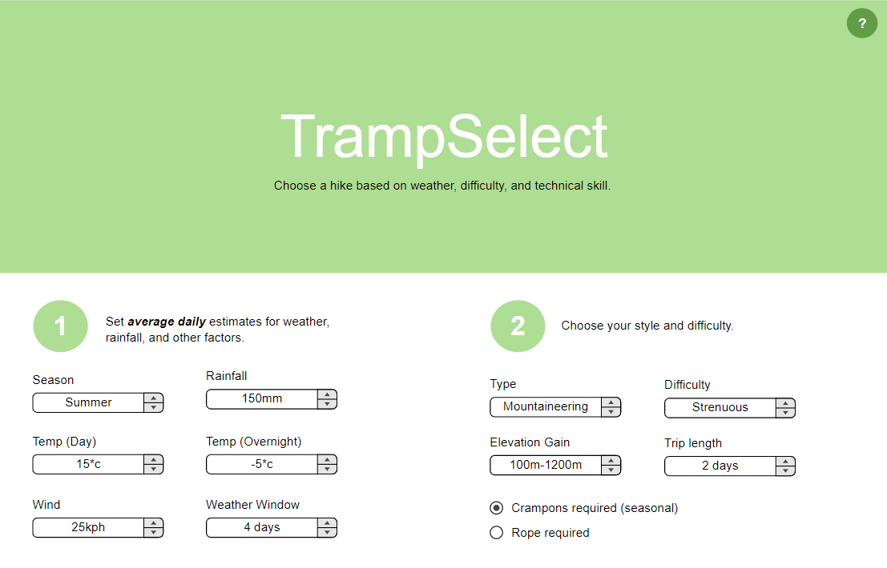
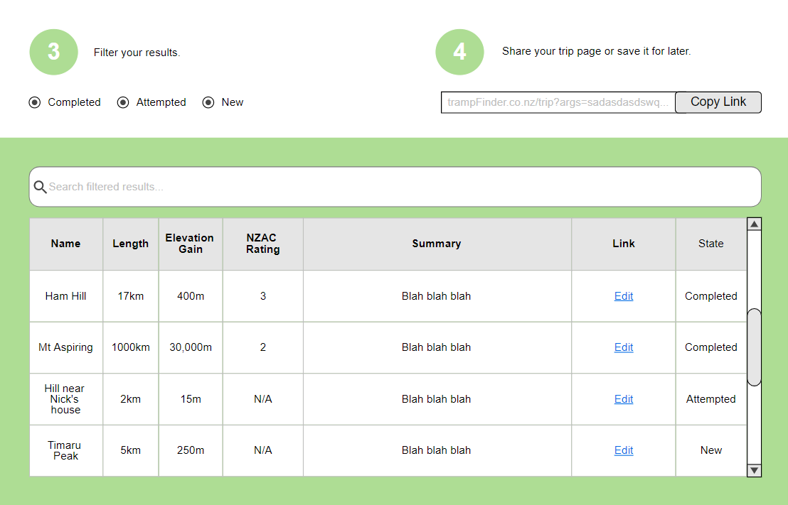

# Tramp Selector

(Tramp is Kiwi for hike!)

[View this website's Moqups page.](https://app.moqups.com/ILr7RrxIwA/view/page/aa9df7b72)

An initial scoping run at an app that filters hikes by weather, difficulty, and technical skill requirements.

## Credits

# Barebones React/TypeScript/Express/Sass Boilerplate
This project is a starting point for a TypeScript based React app that also has a local API server using express.

There are 2 different Webpack configurations. One for the server and one for the client.

## Server
The server build process compiles the TypeScript files found in `/src/server` into a single bundled JavaScript file located in the `/dist` directory.

## Client
The client build process compiles the React app located in `/src/client` into a bundled located at `/public/js/app.js`.

The client configuration will also build the Sass files found at `/src/client/scss`. The App component imports the `app.scss` file which already includes an import for Bootstrap.

## Running the project
In order to run the server, use `npm run dev`, and the server will start on port 3000 (http://localhost:3000).

Webpack will watch the files. Once you save a file, you can refresh your browser to ensure you got the updated client files. If you only change server files, you *shouldn't* need to refresh.
